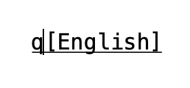
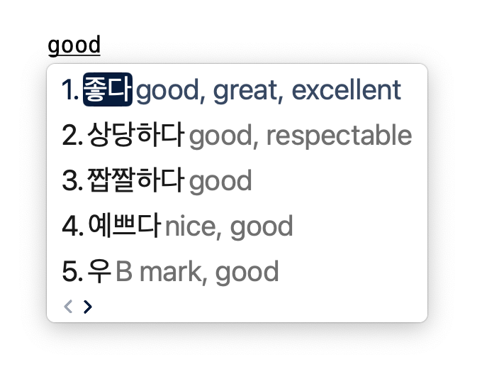

# Hangeul IME

A Hangeul input method based on the Revised Romanization of Korean.

## Revised Romanization of Korean

The spellings used by this input method
is a superset of the spellings standardized in the Revised Romanization (RR). If you already know RR, you can type out most Hangeul expressions using this IME straightaway. However, some of our spellings are not the same as the common RR spellings. The most notable difference is that no sound change rules are observed in our spellings. According to paragraph (8) of the official documentation on the Revised Romanization published by the Ministry of Culture & Tourism in July 2000:

> When it is necessary to convert Romanized Korean back to Hangeul in special cases such as in academic articles, Romanization is done according to Hangeul spelling and not pronunciation. Each Hangeul letter is Romanized as explained in section 2 except that ㄱ, ㄷ, ㅂ, ㄹ are always written as g, d, b, l. When ㅇ has no sound value, it is replaced by a hyphen may also be used when it is necessary to distinguish between syllables.

A Hangeul input method is a special case where conversion to Hangeul is necessary so our spelling largely follows the transliteration rules outlined in paragraph (8) of the documentation. The exceptions to the rules are:

1. **A hyphen '-' is not used to mark syllable boundaries. Capitalize the first letter of the second syllable instead.**

	The hyphen key is a pain to press because it's located far away from the home row and requires your little finger to press. Instead, you can capitalize the first letter of the second syllable if ambiguities arise during syllable segmentation.

	Example: "hanga" can be ambiguously interpreted as "han-ga" (한가) or "hang-a" (항아). By default if you type everything in lowercase, we interpret "hanga" as 한가. If you actually want to type 항아, you should capitalize the second "a": "hangA".

2. **"i" and "y" are interchangeable everywhere.**

	In RR, both "i" and "y" are used to represent the sound /i/ in various vowels. Unlike "i", "y" cannot be used alone and has to be followed by other vowel letters like "a", "e", "o", and "u". When typing a vowel like ㅒ (yae), however, "y" can be alone during the intermediate typing states. To make sure that all intermediate typing states of valid RR syllables are also valid, we decided to allow "i" and "y" to be used interchangeably.

	Example: 민 can be typed out using "min" or "myn".

3. **"u" and "w" are interchangeable everywhere except in the cases of "wi" (ㅟ) and "ui" (ㅢ).**

	The reason is similar to why we made "i"/"y" interchangeable. In RR, "wi" (ㅟ) and "ui" (ㅢ) are the only places in the spelling where "u" and "w" contrasts so we can't interchange "u" and "w" there.

	Examples:
	* 환자 can be typed out using "hwanja" or "huanja".
	* 의사 can only be typed out using "uisa" or "uysa", but not "wisa" or "wysa".
	* 위구 can only be typed out using "wigu" or "wygu", but not "uigu" or "uygu".

4. **"l" and "r" are interchangeable everywhere.**

	In common RR spellings, ㄹ is transcribed as r when followed by a vowel, and as l when followed by a consonant or when appearing at the end of a word. ㄹㄹ is transcribed as ll. Essentially, the phoneme ㄹ has two allophones /r/ and /l/. Since r and l appears in common RR spellings and they both map to the same jamo ㄹ without causing more ambiguity, we decided to allow for both in our schema for the user's convenience.

	Examples:
	* 말 can be typed out using "mal" or "mar".
	* 라 can be typed out using "la" or "ra".

5. **"ch" can be abbreviated as "c" everywhere.**

	In RR spellings, ㅊ is transcribed as "ch". Because you have to type the letter "c" first in the process of typing "ch", we decided to allow "c" as an abbreviation of "ch" at both the syllable initial and final positions. You might prefer to save time and type the abbreviated "c" and you are welcome to. However, you can always type the standard form "ch" if you feel like doing so.

	Examples:
	* 꽃 can be typed out using "kkoch" or "kkoc".
	* 초 can be typed out using "cho" or "co".

## Schema

The schema is split into multiple charts by the types of vowels and consonants in Korean.
* The first row of each chart are the Hangeul jamos.
* The second row of each chart are the standard Revised Romanization spellings of the jamos on the first row.
* The third row of each chart are the alternative spellings for typing.

### Simple Vowels
|ㅏ|ㅓ|ㅗ|ㅜ|ㅡ|ㅣ|ㅐ|ㅔ|ㅚ|ㅟ|
|-|-|-|-|-|-|-|-|-|-|
|a|eo|o|u|eu|i|ae|e|oe|wi|
||||w|ew|y|||||

### Diphthongs
|ㅑ|ㅕ|ㅛ|ㅠ|ㅒ|ㅖ|ㅘ|ㅙ|ㅝ|ㅞ|ㅢ|
|-|-|-|-|-|-|-|-|-|-|-|
|ya|yeo|yo|yu|yae|ye|wa|wae|wo|we|ui|
|ia|ieo|io|iu|iae|ie|ua|uae|uo|ue||

### Plosives
|ㄱ|ㄲ|ㅋ|ㄷ|ㄸ|ㅌ|ㅂ|ㅃ|ㅍ|
|-|-|-|-|-|-|-|-|-|
|g|kk|k|d|tt|t|b|pp|p|

### Affricates
|ㅈ|ㅉ|ㅊ|
|-|-|-|
|j|jj|ch|
|||c|

### Fricatives
|ㅅ|ㅆ|ㅎ|
|-|-|-|
|s|ss|h|

### Nasals
|ㄴ|ㅁ|ㅇ|
|-|-|-|
|n|m|ng|

### Liquids
|ㄹ|
|-|
|l,r|

## Examples

Here are some examples of how to type out Hangeul phrases using this IME. The first column are the Hangeul phrases, the second column are the standard spellings based on RR, and the last three columns are alternative spellings designed to accommodate personal spelling preferences. Note that the list of alternative spellings are not always exhaustive in the interest of space. Please refer to the spelling rules above to derive all alternative spellings.

|Hangeul|Standard Spelling|Alternative 1|Alternative 2|Alternative 3|
|-|-|-|-|-|
|집|`jib`|`jyb`|
|짚|`jip`|`jyp`|
|밖|`bakk`|
|값|`gabs`|
|붓꽃|`buskkoch`|`buskkoc`|`bwskkoc`|`bwskkoch`|
|먹는|`meogneun`|
|아저씨|`ajeoSsi`|
|독립|`doglib`|`doglyb`|`dogryb`|`dogrib`|
|문리|`munli`|`munly`|`munry`|`munri`|
|물엿|`mulYeos`|`murYeos`|`murIeos`|`mulIeos`|
|굳이|`gudI`|`gudY`|`gwdY`|`gwdI`|
|좋다|`johda`|
|가곡|`gagog`|
|조랑말|`jolangmal`|`jorangmal`|`jorangmar`|`jolangmar`|
|없었습니다|`eobsEossseubnida`|

## Comparison with Other Schemas
Unlike other schemas including 2-Set and HNC Romaja, this schema is intended to closely comply with the transliteration standard of the Revised Romanization.

Compared with 2-Set, the advantage of this schema is that for people who are already familiar with the QWERTY keyboard, picking up this schema only requires you to know the RR spellings and no memorization of keyboard layout is needed. Reusing the QWERTY layout is very beneficial to Korean learners because they can focus on learning the romanization rather than memorizing the keyboard layout.

Compared with HNC Romaja, the advantage of this schema is that the spellings of the vowels are closer to their phonetic values rather than shape compositions. For example, the vowel ㅐ is spelled as "ai" in HNC Romaja. This resembles the shape composition of the two jamos ㅏ ("a") and ㅣ ("i") more than the sound of the vowel. In this schema, ㅐ is spelled as "ae" which aims to approximate the sound /ɛ/ rather than the shape composition a + i.

## Reverse Lookup using English
You can press 'q' to activate reverse lookup using English. Under the hood, we use the [Korean-English Learners' Dictionary](https://krdict.korean.go.kr/eng/) developed by the National Institute of Korean Language. The dictionary is licensed under the Creative Commons Attribution - Share Alike license.

### Enter Lookup Mode
As soon as you press 'q', you will see a prompt that says "[English]" after your cursor:



### Lookup English Words
Go ahead and type an English word you want to lookup and the most relevant Korean words with that meaning will show up as candidates.



### Quit Lookup Mode
Simply delete the letter 'q' before your cursor to get back to Hangeul mode.

### Reverse Lookup Demo
The GIF below shows an example workflow that seamlessly switches between the default Hangeul mode and the Lookup mode.


## Seamless vs Composition Modes
For apps that support TSMDocumentAccess protocol, we provide a seamless mode without the need of an inline composition buffer. All jamos are immediately committed to screen and we use `replacementRange` argument in `client()?.insertText` to modify previously committed jamos. Here's a list of apps that support seamless mode:

1. Spotlight
2. Finder
3. TextEdit
4. Word
5. Dictionary.app
6. Telegram
7. WeChat
8. Slack
9. Safari
10. Chrome
11. Zoom
12. XCode
13. App Store

Some apps, like the Terminal, do not have good support for the TSMDocumentAccess protocol. For those apps, we fallback to composition mode, which does require an inline composition buffer. Here's some example apps that only support composition mode:

1. WhatsApp
2. LINE
3. Notion
4. Terminal
 
## Build and Run

### Build and Run Hangeul

Hangeul is the name of the target in Xcode for the input method app. If you change parts of the source code and run the project in Xcode, you may see a build error that says:

```
Embedded binary is not signed with the same certificate as the parent app. Verify the embedded binary target's code sign settings match the parent app's.
```

I'm not sure about the cause of this error but a workaround is to:
1. Stop the currently running instance
2. Manually delete the `Hangeul.app` in your `/Library/Input Methods` directory
3. Build again

### Build and Run KrDictEmbeddingsGenerator

KrDictEmbeddingsGenerator is set up as a unit testing bundle. However, it's actually just a Swift script that generates an ML model containing the sentence embeddings for each english word in `KrDict.json`.

If you show the test navigator on the left of Xcode and click on the run icon on the right of the testGenerateKrDictEmbeddings() function, you will get a build error that says:

```
Cycle in dependencies between targets 'Hangeul' and 'InputControllerTests'; building could produce unreliable results.
```

I'm not sure about the cause of this error but a workaround is to:
1. Select the Hangeul target in Xcode
2. Go to Build Phases tab
3. Expand the last build phase called Copy Files
4. Check "Copy only when installing"
5. Once you are done running the KrDictEmbeddingsGenerator, uncheck "Copy only when installing"

## Credits

* This project was bootstrapped using the sample code for macOS IMKit from [macOS_IMKitSample_2021](https://github.com/ensan-hcl/macOS_IMKitSample_2021)
* Great open source IMEs I referenced:
	* [Fire](https://github.com/qwertyyb/Fire), a Wubi input method for simplified Chinese
	* [Gureum](https://github.com/gureum/gureum/), a Hangeul/Hanja input method for Korean
	* [vChewing](https://github.com/vChewing/vChewing-macOS), a Zhuyin input method for simplified/traditional Chinese
* The schema and examples are derived from the [official documentation on the Revised Romanization](https://web.archive.org/web/20070916025652/http://www.korea.net/korea/kor_loca.asp?code=A020303)

## License
MIT
